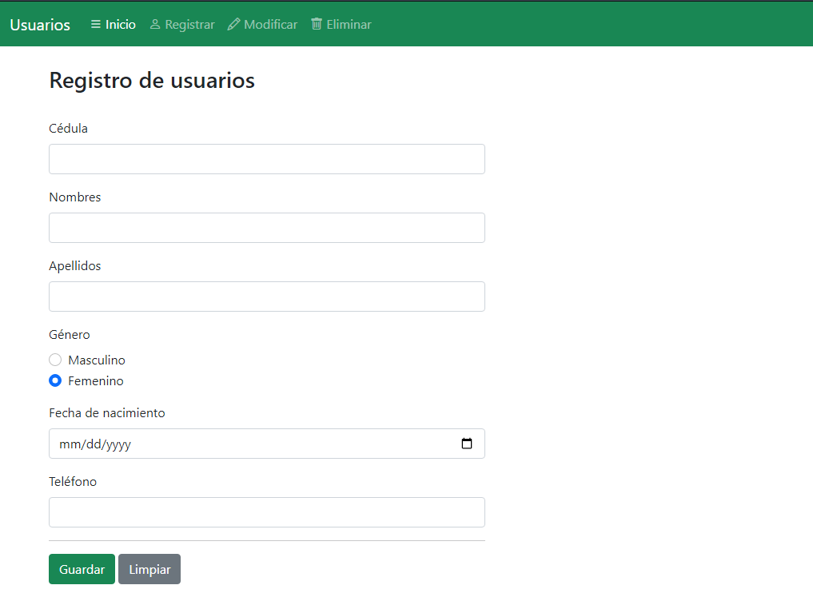

# Crud Usuarios PHP

GRUPO 8

INTEGRANTES:  

<ul>
<li>Valeria Caicedo</li>
<li>Andrés Alejandro Ayala Chamorro</li>
<li>Vanessa López Gelpud</li>
<li>Iván Andrés Santacruz</li>
</ul>
 
App que permite realizar un CRUD utilizando PHP y MySQL. Ejercicio realizado para la materia de Desarrollo Movil en la Universidad de Nariño
 

